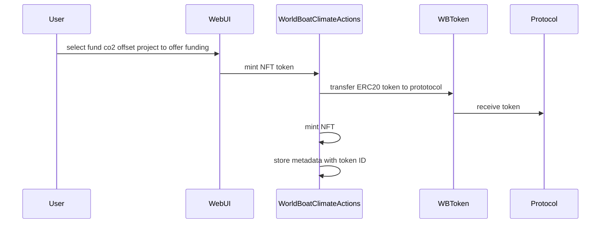
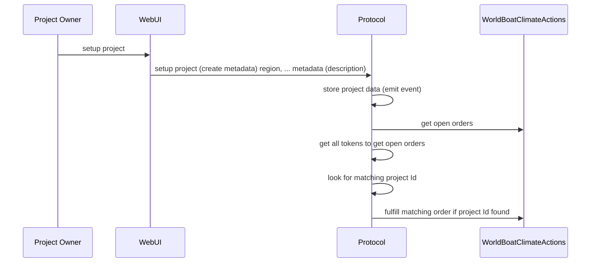

# 

Offer funding project for CO2 offset project

Project owner create a co2 offset project 

reusing "WBToken" at 0x85B815f9B358d90C4338C216B9F346BE47F820fA
deployer================0x78BA6B002adEf3973622b1632e4537C39c6c1797
deploying "WorldBoatProtocol" (tx: 0xd928a3d622656a783466d6a065a123e5e71258a19c8d9a3c91d9915ca8d3d8a3)...: deployed at 0xE496D96A1b9F6C66702A4585B60d56C6540037F4 with 807027 gas
deploying "WorldBoatClimateActions" (tx: 0xf5fff3c4f66e31249f640a4bfefc15c0f3407356c4dc86d0f56871d399fb1458)...: deployed at 0xe8b80E3664Bd8fD357f6Ed2B33e32e320762c648 with 2211196 gas