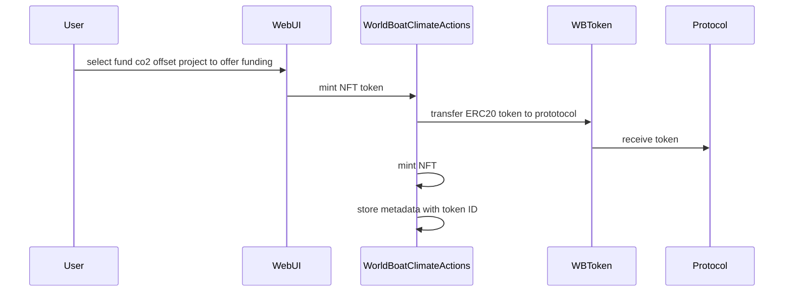
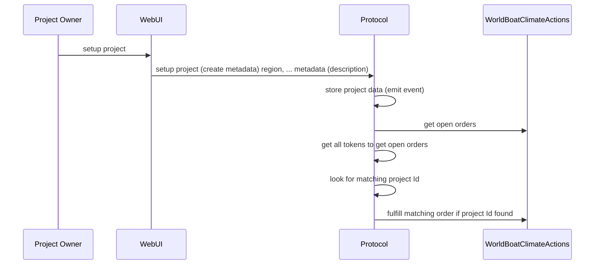

# 

Offer funding project for CO2 offset project

Project owner create a co2 offset project 

reusing "WBToken" at 0x85B815f9B358d90C4338C216B9F346BE47F820fA
deployer================0x78BA6B002adEf3973622b1632e4537C39c6c1797
deploying "WorldBoatProtocol" (tx: 0x552626ed0ffc767b69697de0db4ede11fc8501d1c7e82532a9cdba43c5dfca61)...: deployed at 0x6669B4Dc7C88Fd846743F4994aB6ff59FDc05a4A with 822136 gas
deploying "WorldBoatClimateActions" (tx: 0x63ffd898d4b63bf136b774d9fd4566efd650e900a05dd2cb2c12ba62224180b3)...: deployed at 0x3Ddb04148Cc92a839426085eb94c87b8f8bD5cF9 with 2258070 gas