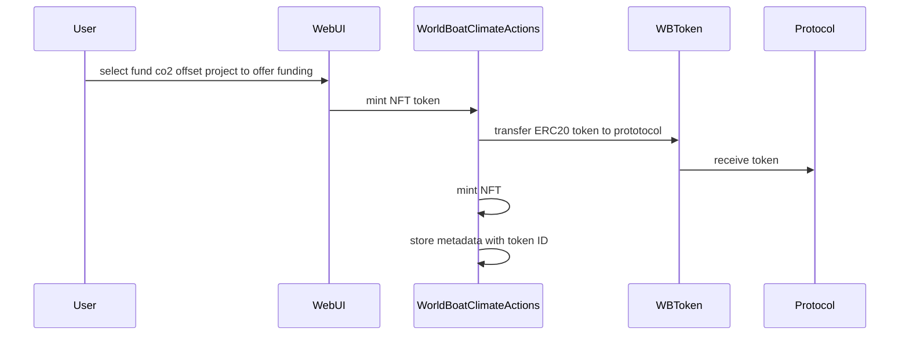
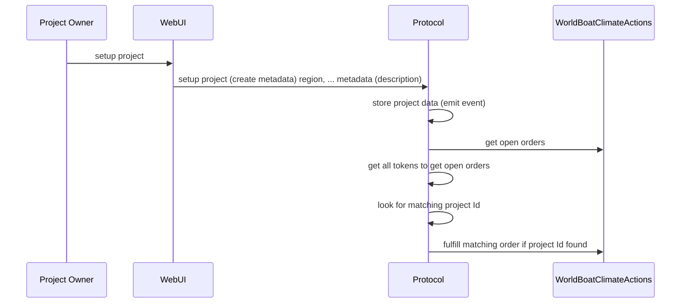

# 

Offer funding project for CO2 offset project

Project owner create a co2 offset project 

contracts in arbitrumSepolia:
deployer = 0x78BA6B002adEf3973622b1632e4537C39c6c1797
deploying "WorldBoatProtocol" (tx: 0xd128b04bed0387c622bbeb83ba8a7feb592cad88a78d4d467dd65ef4ac36bd48)...: deployed at 0x2753D07A5B040DF342721e33058942fAd9Bb3E3e with 806763 gas
deploying "WorldBoatClimateActions" (tx: 0xbb82df44f018a30e89209367327a63557299991ac589a68371e9294e75e0a0b9)...: deployed at 0xfdd6076e296eF65E211A4c894FEfC52880e86935 with 2192662 gas
deploying "WBToken" (tx: 0xc7513580820fc14065e550758301c6ca475575ac3ac73fa99f4de02b5ae0f58a)...: deployed at 0x85B815f9B358d90C4338C216B9F346BE47F820fA with 650902 gas