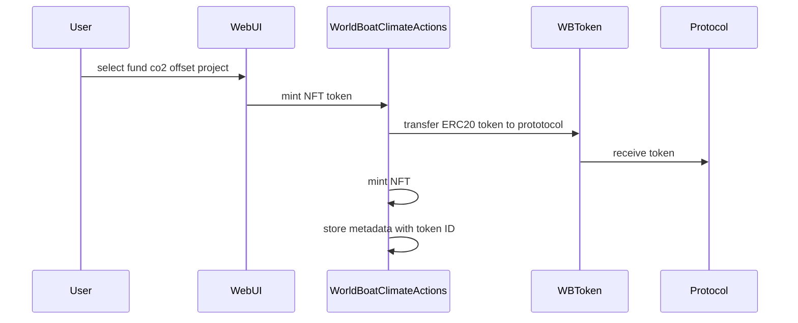
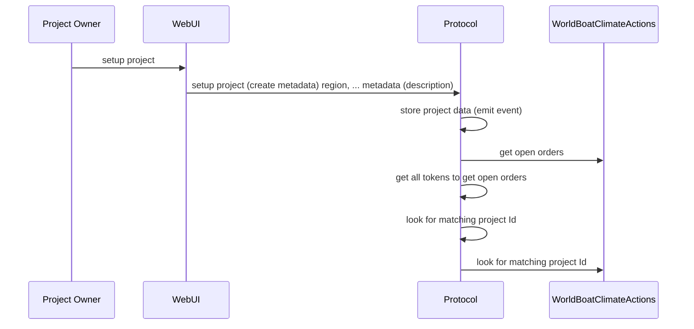
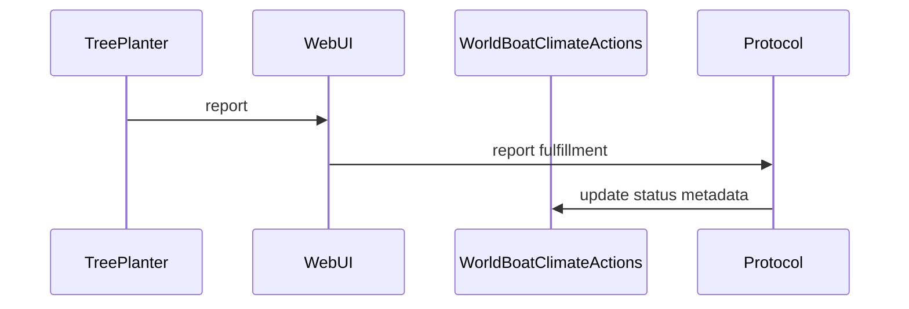

# 

Fund project for CO2 offset

```mermaid
sequenceDiagram
    participant User
    participant WebUI
    participant WorldBoatClimateActions
    participant WBToken
    participant Protocol

    User ->> WebUI: select fund co2 offset project
    WebUI ->> WorldBoatClimateActions: mint NFT token 
    WorldBoatClimateActions ->> WBToken: transfer ERC20 token to prototocol
    WBToken ->> Protocol: receive token
    WorldBoatClimateActions ->> WorldBoatClimateActions: mint NFT
    WorldBoatClimateActions ->> WorldBoatClimateActions: store metadata with token ID
```

Project owner create a co2 offset project

```mermaid
sequenceDiagram
    participant ProjectOwner as Project Owner
    participant WebUI
    participant Protocol

    ProjectOwner ->> WebUI: setup project
    WebUI ->> Protocol: setup project (create metadata) region, ... metadata (description)
    Protocol ->> Protocol: store project data (emit event)
    Protocol ->> WorldBoatClimateActions: get open orders
    Protocol ->> Protocol: get all tokens to get open orders
    Protocol ->> Protocol: look for matching project Id
    Protocol ->> WorldBoatClimateActions: look for matching project Id

```

```mermaid
sequenceDiagram
    participant TreePlanter
    participant WebUI
    participant WorldBoatClimateActions
    participant Protocol

    TreePlanter ->> WebUI: report 
    WebUI ->> Protocol: report fulfillment 
    Protocol ->> WorldBoatClimateActions: update status metadata

```