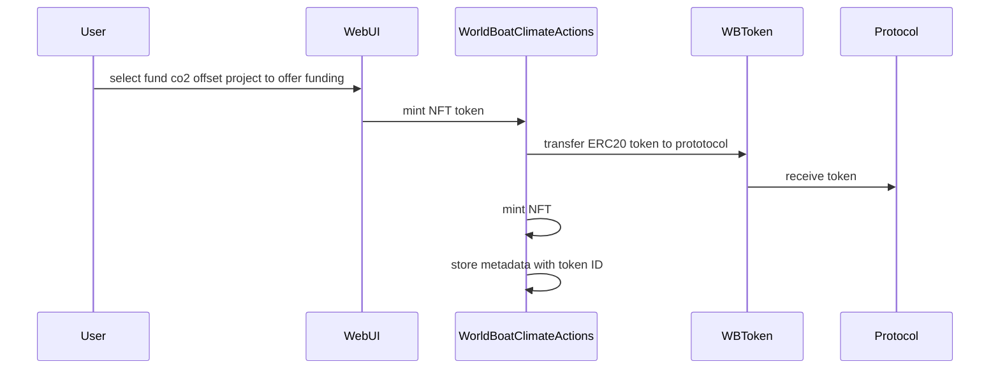
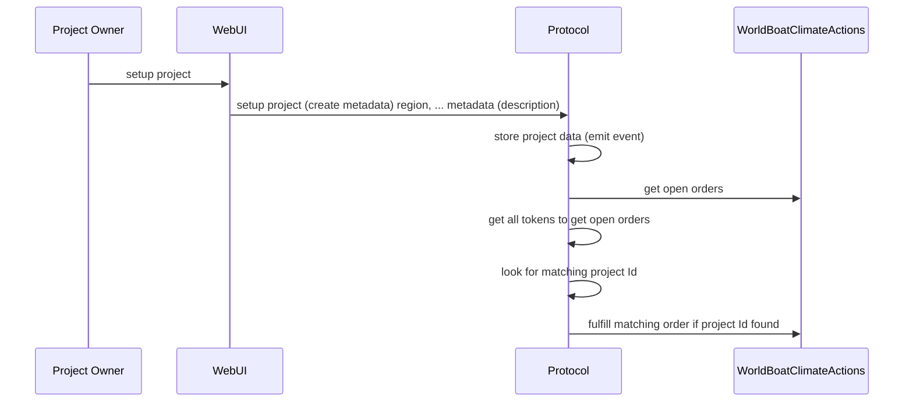

# 

Offer funding project for CO2 offset project

Project owner create a co2 offset project 

reusing "WBToken" at 0x85B815f9B358d90C4338C216B9F346BE47F820fA
deployer================0x78BA6B002adEf3973622b1632e4537C39c6c1797
deploying "WorldBoatProtocol" (tx: 0xa45949eeabea91b6bbc7a074f47228f36ccf9e0ea5c8025bea389919de0a7a73)...: deployed at 0xcA7E1951571a3B61dF0Ce1C4c4e9f2a909E108C6 with 862075 gas
deploying "WorldBoatClimateActions" (tx: 0x96717b31959c26f2a07e4dd64e8d939257462f1a239937ca59de25bcf7c1be7b)...: deployed at 0x0F48d5A78e6B65E3A4f599712178D4E976F92354 with 2303726 gas