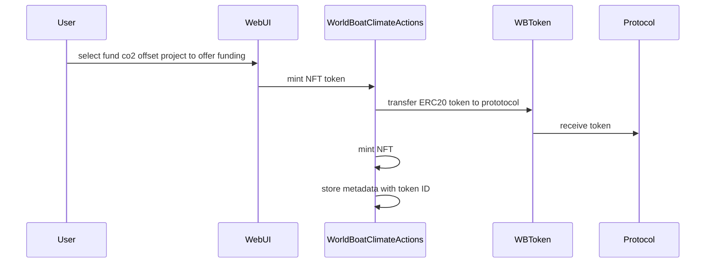
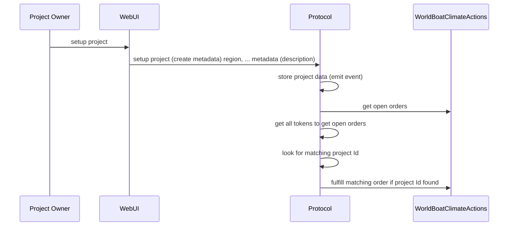

# 

Offer funding project for CO2 offset project

Project owner create a co2 offset project 

reusing "WBToken" at 0x85B815f9B358d90C4338C216B9F346BE47F820fA
deployer================0x78BA6B002adEf3973622b1632e4537C39c6c1797
deploying "WorldBoatProtocol" (tx: 0xb11f0a40f851375367ba13b5b883ecd5b156c41e41b588069dafc7f1131346b6)...: deployed at 0x200f6D9ADA16e6FF2CB5C3064dABcdF8bCE1f4C6 with 806775 gas
deploying "WorldBoatClimateActions" (tx: 0xb83c38bf1b0577a61f0ae9ab88f4a464b4e05643a40833ddcddad6074cd2585d)...: deployed at 0x720A320B98A543481b62a502E8F6bEA1967CF308 with 2211208 gas
📝 Updated TypeScript contract definition file on ../nextjs/contracts/deployedContracts.ts